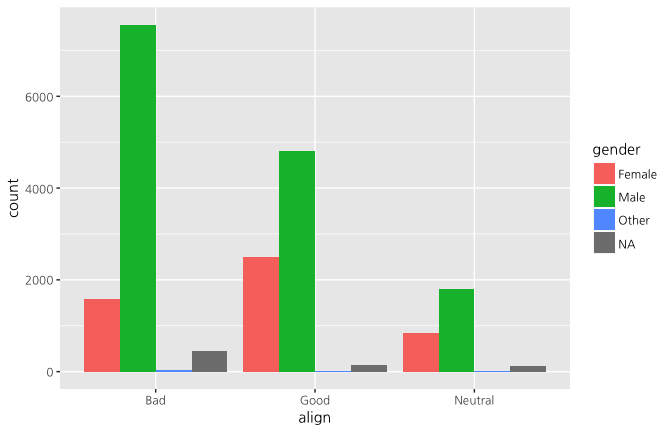
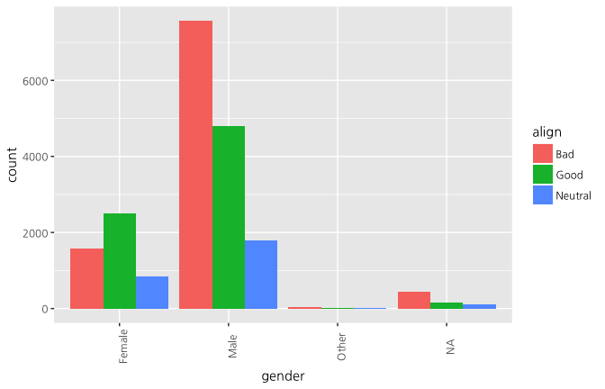

## Exploring Categorical Data

<!-- RMD 설정 -->


### Contingency table review

> Excercise

In this chapter you'll continue working with the comics dataset introduced in the video. This is a collection of characteristics on all of the superheroes created by Marvel and DC `comics` in the last 80 years.

Let's start by creating a contingency table, which is a useful way to represent the total counts of observations that fall into each combination of the levels of categorical variables.

> Instructions

The dataset has been loaded into your workspace as `comics`.

- Type the name of the dataset to look at the rows and columns of the dataset.
- View the `levels()` that the `align` variable can take.
- View the `levels()` that the `gender` variable can take.
- Create a contingency table of the same two variables.


```r
# Print the first rows of the data
data("comic_characters")
comics <- comic_characters
glimpse(comics)
```

```
## Observations: 23,272
## Variables: 16
## $ publisher        <chr> "Marvel", "Marvel", "Marvel", "Marvel", "Marv...
## $ page_id          <int> 1678, 7139, 64786, 1868, 2460, 2458, 2166, 18...
## $ name             <chr> "Spider-Man (Peter Parker)", "Captain America...
## $ urlslug          <chr> "\\/Spider-Man_(Peter_Parker)", "\\/Captain_A...
## $ id               <chr> "Secret Identity", "Public Identity", "Public...
## $ align            <chr> "Good Characters", "Good Characters", "Neutra...
## $ eye              <chr> "Hazel Eyes", "Blue Eyes", "Blue Eyes", "Blue...
## $ hair             <chr> "Brown Hair", "White Hair", "Black Hair", "Bl...
## $ sex              <chr> "Male Characters", "Male Characters", "Male C...
## $ gsm              <chr> NA, NA, NA, NA, NA, NA, NA, NA, NA, NA, NA, N...
## $ alive            <chr> "Living Characters", "Living Characters", "Li...
## $ appearances      <int> 4043, 3360, 3061, 2961, 2258, 2255, 2072, 201...
## $ first_appearance <chr> "1962, August", "1941, March", "1974, October...
## $ month            <chr> "August", "March", "October", "March", "Novem...
## $ year             <int> 1962, 1941, 1974, 1963, 1950, 1961, 1961, 196...
## $ date             <date> 1962-08-01, 1941-03-01, 1974-10-01, 1963-03-...
```

```r
names(comics)[9] = "gender"
names(comics)[13] = "first_appear"

# table(comics$id)
# table(comics$align)
# table(comics$eye)
# table(comics$hair)
# table(comics$gender)
# table(comics$gsm)
# table(comics$alive)

# Data 정리
comics$id <- str_replace_all(comics$id, " Identity", "")
comics$align <- str_replace_all(comics$align, " Characters", "")
comics$eye <- str_replace_all(comics$eye, " Eyes", "")
comics$hair <- str_replace_all(comics$hair, " Hair", "")
comics$gender <- str_replace_all(comics$gender, " Characters", "")
comics$gender <- str_replace_all(comics$gender,"Agender", "Other")
comics$gender <- str_replace_all(comics$gender,"Genderless", "Other")
comics$gender <- str_replace_all(comics$gender,"Genderfluid", "Other")
comics$gender <- str_replace_all(comics$gender,"Transgender", "Other")
comics$gsm <- str_replace_all(comics$gsm, " Characters", "")
comics$alive <- str_replace_all(comics$alive, " Characters", "")

# factor type으로 변환
comics$gender <- as.factor(comics$gender)
comics$publisher <- as.factor(comics$publisher)
comics$page_id <- as.factor(comics$page_id)
comics$name <- as.factor(comics$page_id)
comics$urlslug <- as.factor(comics$urlslug)
comics$id <- as.factor(comics$id)
comics$align <- as.factor(comics$align)
comics$eye <- as.factor(comics$eye)
comics$hair <- as.factor(comics$hair)
comics$gsm <- as.factor(comics$gsm)
comics$alive <- as.factor(comics$alive)
comics$first_appear <- as.factor(comics$first_appear)

# Print the first rows of the data
comics
```

```
## # A tibble: 23,272 x 16
##    publisher page_id   name                                    urlslug
##       <fctr>  <fctr> <fctr>                                     <fctr>
##  1    Marvel    1678   1678             "\\/Spider-Man_(Peter_Parker)"
##  2    Marvel    7139   7139       "\\/Captain_America_(Steven_Rogers)"
##  3    Marvel   64786  64786 "\\/Wolverine_(James_%22Logan%22_Howlett)"
##  4    Marvel    1868   1868   "\\/Iron_Man_(Anthony_%22Tony%22_Stark)"
##  5    Marvel    2460   2460                   "\\/Thor_(Thor_Odinson)"
##  6    Marvel    2458   2458            "\\/Benjamin_Grimm_(Earth-616)"
##  7    Marvel    2166   2166             "\\/Reed_Richards_(Earth-616)"
##  8    Marvel    1833   1833            "\\/Hulk_(Robert_Bruce_Banner)"
##  9    Marvel   29481  29481             "\\/Scott_Summers_(Earth-616)"
## 10    Marvel    1837   1837            "\\/Jonathan_Storm_(Earth-616)"
## # ... with 23,262 more rows, and 12 more variables: id <fctr>,
## #   align <fctr>, eye <fctr>, hair <fctr>, gender <fctr>, gsm <fctr>,
## #   alive <fctr>, appearances <int>, first_appear <fctr>, month <chr>,
## #   year <int>, date <date>
```

```r
# Check levels of align
levels(comics$align)
```

```
## [1] "Bad"                "Good"               "Neutral"           
## [4] "Reformed Criminals"
```

```r
# Check the levels of gender
levels(comics$gender)
```

```
## [1] "Female" "Male"   "Other"
```

```r
# Create a 2-way contingency table
tab <- table(comics$align, comics$gender)
```

### Dropping levels

> Excercise

The contingency table from the last exercise revealed that there are some levels that have very low counts. To simplify the analysis, it often helps to drop such levels.

In R, this requires two steps: first filtering out any rows with the levels that have very low counts, then removing these levels from the factor variable with `droplevels()`. This is because the `droplevels()` function would keep levels that have just 1 or 2 counts; it only drops levels that don't exist in a dataset.

> Instructions

The contingency table from the last exercise is available in your workspace as `tab`.

- Load the `dplyr` package.
- Print `tab` to find out which level of `align` has the fewest total entries.
- Use `filter()` to filter out all rows of `comics` with that level, then drop the unused level with `droplevels()`. Save the simplifed dataset over the old one as `comics`.


```r
# Load dplyr
#library(dplyr)

# Print tab
tab
```

```
##                     
##                      Female Male Other
##   Bad                  1573 7561    32
##   Good                 2490 4809    17
##   Neutral               836 1799    17
##   Reformed Criminals      1    2     0
```

```r
# Remove align level
comics <- comics %>%
  filter(align != "Reformed Criminals") %>%
  droplevels()
```

### Side-by-side barcharts

> Excercise

While a contingency table represents the counts numerically, it's often more useful to represent them graphically.

Here you'll construct two side-by-side barcharts of the `comics` data. This shows that there can often be two or more options for presenting the same data. Passing the argument `position = "dodge"` to `geom_bar()` says that you want a side-by-side (i.e. not stacked) barchart.

> Instructions

- Load the `ggplot2` package.
- Create a side-by-side barchart with `align` on the x-axis and `gender` as the `fill` aesthetic.
- Create another side-by-side barchart with `gender` on the x-axis and `align` as the `fill` aesthetic. Rotate the axis labels 90 degrees to help readability.


```r
# Load ggplot2
library(ggplot2)

# Create side-by-side barchart of gender by alignment
ggplot(comics, aes(x = align, fill = gender)) + 
  geom_bar(position = "dodge")
```

<!-- -->

```r
# Create side-by-side barchart of alignment by gender
ggplot(comics, aes(x = gender, fill = align)) + 
  geom_bar(position = "dodge") +
  theme(axis.text.x = element_text(angle = 90))
```

<!-- -->


